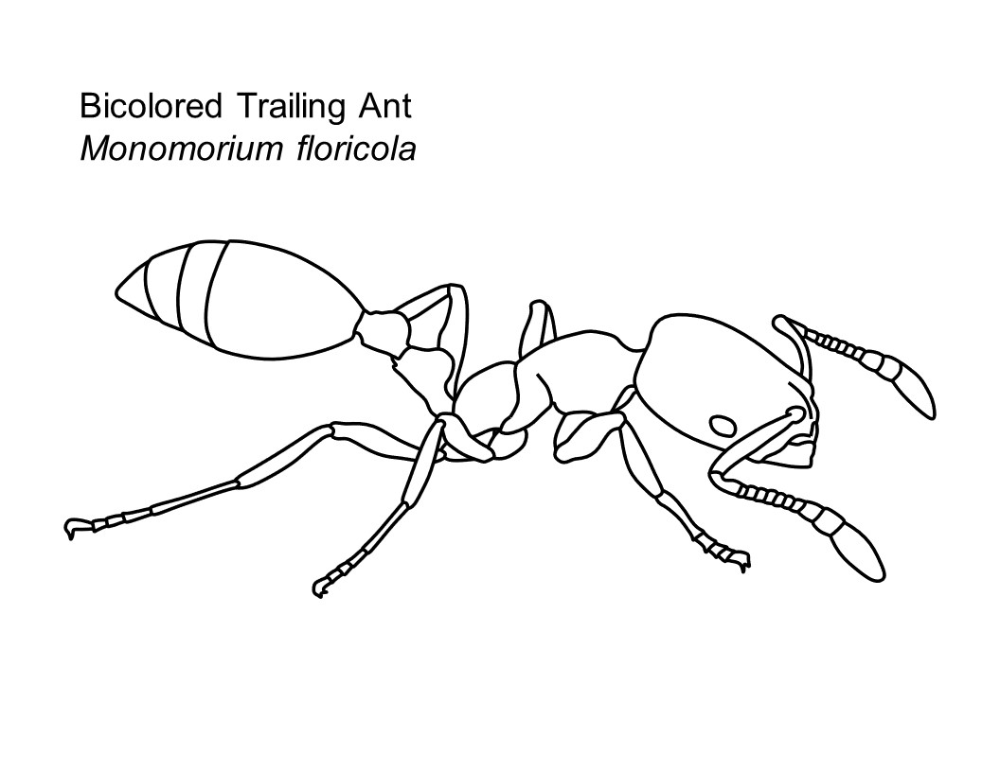

# [The Invasive Ant Coloring Book Download (.pptx)](Invasive_Ant_Coloring_book.pptx)

## Individual Pages
[Obscure Rover Ant, *Brachymyrmex obscurior*](B_obscurior.JPG)

[Argentine Ant, *Linepithema humile*](L_humile.JPG)

[Bicolored Trailing Ant, *Monomorium floricola*](M_floricola.JPG)

[Tawny Crazy Ant, *Nylanderia fulva*](N_fulva.JPG)

[Tawny Crazy Ant, *Nylanderia fulva* (queen)](N_fulva_queen.JPG)

[Elongate Twig Ant, *Pseudomyrmex gracilis*](P_gracilis.JPG)

[Longhorn Crazy Ant, *Paratrechina longicornis*](P_longicornis.JPG)

[African Big-Headed Ant, *Pheidole megacephala* (major)](P_megacephala_major.JPG)

[African Big-Headed Ant, *Pheidole megacephala* (minor)](P_megacephala_minor.JPG)

[African Big-Headed Ant, *Pheidole megacephala* (queen)](P_megacephala_queen.JPG)

[Red-Imported Fire Ant, *Solenopsis invicta*](S_invicta.JPG)

[White-Footed Ant, *Technomyrmex difficilis*](T_difficilis.JPG)

[Ghost Ant, *Tapinoma melanocephalum*](T_melanocephalum.JPG)

 
 

 
 

 
 

 
 

# [Home](https://jlwilliants.github.io/)
