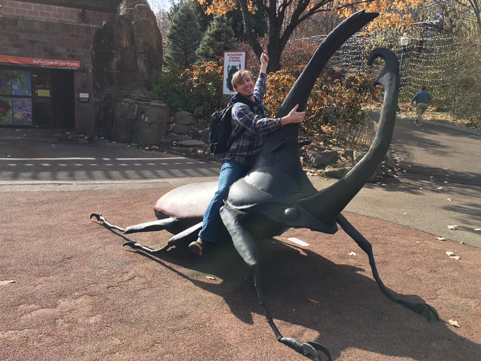

# Jason L. Williams, M.S.

Ph.D. candidate

Entomology and Nematology Department 

University of Florida

## [About Me](https://jlwilliants.github.io/AboutMe/)
## [Curriculum Vitae](https://jlwilliants.github.io/CurriculumVitae/)
## [Invasive Ant Coloring Book](https://jlwilliants.github.io/ColoringBook/)
## [Photos (Flickr album)](https://www.flickr.com/photos/140139359@N06/)

